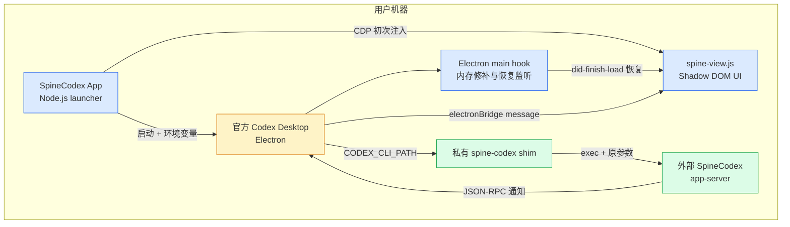
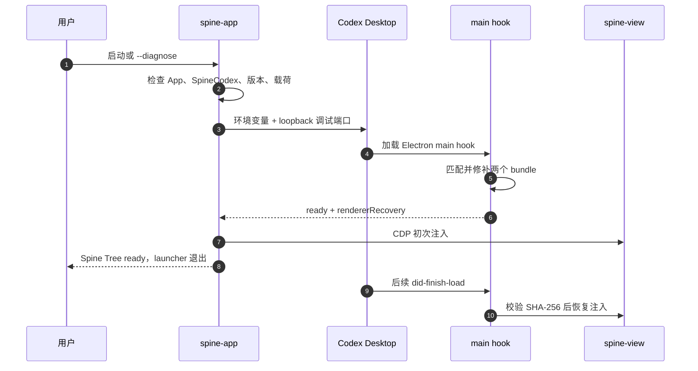
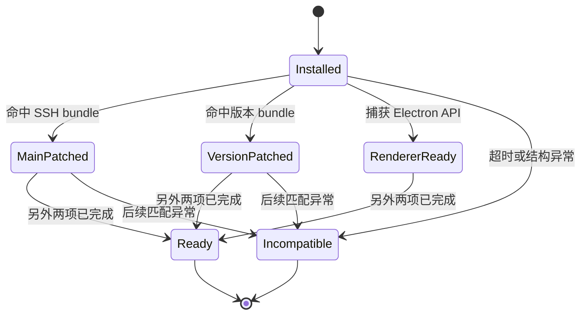

# 01 · 架构与功能原理

## 01.1 项目定位

`spine-codex-app-fix` 是一个轻量 Node.js ESM 启动器和 Electron 运行时外挂。它不包含官方 Codex Desktop，也没有 fork 官方 React UI；发布包只带启动器、注入脚本、私有 Node.js runtime 和本项目声明文件。[package.json:2](../package.json#L2) 将包标为 private，[THIRD_PARTY_NOTICES.md:3](../THIRD_PARTY_NOTICES.md#L3) 明确 Codex Desktop 与 SpineCodex 都是外部依赖。

当前实现包含三层：

- 启动层：发现依赖、预检、设置环境变量并启动官方桌面应用。
- Electron 主进程兼容层：在内存中结构化匹配并修补 SSH bootstrap 与版本检查。
- Renderer 展示层：消费 Spine 通知，在官方摘要区域挂载隔离的 Shadow DOM UI。

## 01.2 进程拓扑

这张图表达的关键点是：官方应用仍然拥有聊天、线程和 app-server 连接；SpineCodex App 只替换后端命令并增加一个渲染消费者。

## 01.3 启动与后端替换

启动入口先运行 `diagnose()`。只有依赖、版本、renderer 载荷均通过检查后才继续；失败会汇总缺失项并退出，不会留下半配置状态。[spine-app.mjs:56](../spine-app.mjs#L56)

预检完成后，启动器构造以下关键环境变量：[spine-app.mjs:97](../spine-app.mjs#L97)

| 变量 | 作用 |
|---|---|
| `PATH` | 把项目私有 `bin` 放到最前，保证本地命令命中 shim |
| `CODEX_CLI_PATH=spine-codex` | 让官方应用启动 SpineCodex 而不是官方 `codex` |
| `SPINE_CODEX_BINARY` | shim 最终执行的真实 SpineCodex 路径 |
| `SPINE_CODEX_MIN_VERSION` | 主进程版本兼容补丁的最低版本 |
| `SPINE_CODEX_RENDERER_PATH` | renderer 的绝对路径 |
| `SPINE_CODEX_RENDERER_SHA256` | renderer 内容摘要，防止路径载荷被替换 |
| `NODE_OPTIONS` | macOS 下加载 Electron 主进程 hook |

`CODEX_CLI_PATH` 故意使用可移植命令名，而不是本机绝对路径。这样本地由私有 PATH 命中 shim，远程 SSH 则由远端登录 shell 自己解析同名命令，避免把本机路径发到服务器。[spine-app.mjs:100](../spine-app.mjs#L100)

私有 shim 保留官方扩展传入的全部参数，仅在前面追加 `--disable image_generation`，再执行外部 SpineCodex。[bin/spine-codex:5](../bin/spine-codex#L5)、[bin/spine-codex.mjs:11](../bin/spine-codex.mjs#L11)

## 01.4 平台启动差异

macOS 通过 `/usr/bin/open -n --env ... -a <app>` 启动，并传入 loopback CDP 参数。[spine-app.mjs:820](../spine-app.mjs#L820)

Windows 直接启动 AppX/Electron 可执行文件，并额外使用 `--inspect-brk=127.0.0.1:<port>`，在主脚本恢复前注入 CommonJS hook。[spine-app.mjs:850](../spine-app.mjs#L850)、[lib/main-inspector.mjs:3](../lib/main-inspector.mjs#L3)

无论平台如何，调试端口都只绑定 loopback，且 CDP WebSocket 的协议、主机和端口必须精确匹配预留值，否则拒绝注入。[spine-app.mjs:941](../spine-app.mjs#L941)

## 01.5 Electron 主进程兼容层

主 hook 不按生成文件名或压缩变量名硬编码，而是按稳定的字符串和结构特征匹配：

- SSH bootstrap：以固定 socket marker 和 cleanup/launch 结构定位，替换远端 app-server 的清理、锁和就绪检查。[spine-electron-main-hook.cjs:136](../spine-electron-main-hook.cjs#L136)
- 版本检查：以“不支持的 app-server 版本”错误前缀和比较器结构定位，在保留官方最低版本逻辑的同时接受 SpineCodex 最低版本。[spine-electron-main-hook.cjs:196](../spine-electron-main-hook.cjs#L196)

`installMainProcessHook()` 临时替换 `Module._extensions[".js"]`。它分别等待 SSH bundle、版本 bundle 和 renderer recovery 三个条件；任一结构未出现或匹配不唯一，都写入 `incompatible` 状态并 fail closed。[spine-electron-main-hook.cjs:458](../spine-electron-main-hook.cjs#L458)

## 01.6 Renderer 恢复与载荷校验

主 hook 要求 renderer 路径是绝对路径，并验证 64 位十六进制 SHA-256；内容不一致时不会安装恢复监听。[spine-electron-main-hook.cjs:304](../spine-electron-main-hook.cjs#L304)

恢复监听只处理类型为 window、URL 精确为 `app://-/index.html` 的主界面。`did-finish-load` 时调用 `executeJavaScript(payload.source, false)`；同一 WebContents 使用 WeakMap 去重并发注入。[spine-electron-main-hook.cjs:383](../spine-electron-main-hook.cjs#L383)

启动器本身还会通过 CDP 执行一次初始注入，并通过 renderer 内部版本 guard 保证幂等。[spine-app.mjs:973](../spine-app.mjs#L973)

## 01.7 Renderer UI 与缓存

`spine-view.js` 监听 window message，识别三类通知：`turn/spineTree/updated`、`turn/spineSpawnProgress/updated`、`rawResponseItem/completed`。[spine-view.js:5](../spine-view.js#L5)、[spine-view.js:5419](../spine-view.js#L5419)

处理链分为：

1. `normalizeSnapshot()` 校验字段、裁剪文本并生成稳定缓存对象。[spine-view.js:1186](../spine-view.js#L1186)
2. `projectSnapshot()` 把 Root Epoch、关闭节点 memory、live 节点和 Spawn 分支投影为最多 300 行。[spine-view.js:2107](../spine-view.js#L2107)
3. `mountUi()` 查找官方摘要 surface 并挂载自己的 Shadow DOM。[spine-view.js:4296](../spine-view.js#L4296)
4. 设置和导航仍通过桌面端 `window.electronBridge` 与 `vscode://codex/...` 私有路由完成。[spine-view.js:4961](../spine-view.js#L4961)

缓存使用 `localStorage`，并设置 32 个线程、2.5 MB、2000 节点、30 天 TTL 等硬上限，避免树历史无限增长。[spine-view.js:20](../spine-view.js#L20)

## 01.8 为什么不能直接搬进 VS Code

桌面 renderer 的三个基础依赖在 VS Code Extension Host 中都不存在：

| 桌面依赖 | VS Code 情况 | 结论 |
|---|---|---|
| `app://-/index.html` 与官方摘要 DOM | 官方扩展运行在自己的 Webview | 第三方扩展不能稳定访问 |
| `window.electronBridge` | VS Code Webview 只有自己的 `acquireVsCodeApi()` | API 不兼容 |
| `vscode://codex/...` 桌面私有路由 | 不是公开 VS Code Extension API | 不应依赖 |
| Electron main bundle patch | VS Code Extension Host 不是该桌面主进程 | 注入位置错误 |

因此可复用的是“Spine app-server 通知与 UI 投影算法”，不能复用“Electron/CDP/DOM 挂载链”。

## 01.9 构建、测试与安全边界

`npm run check` 同时做语法检查、15 个 Node 测试、renderer 合同测试和 SSH hook 测试。[package.json:21](../package.json#L21)

发布边界测试明确要求构建器只打包 wrapper 与固定 Node runtime，不包含 SpineCodex 或官方应用。[test/release-boundary.test.mjs:40](../test/release-boundary.test.mjs#L40)

安全文档说明了 loopback CDP 的同用户进程风险，并强调不修改 `app.asar`、不改 SSH 配置、路径与摘要都要校验。[SECURITY.md:7](../SECURITY.md#L7)

## 01.10 已知缺陷 / 改进建议

| 维度 | 当前 | 建议 |
|---|---|---|
| 官方版本耦合 | 依赖 Electron bundle 结构 | 每个官方版本跑 fixture 与真机 smoke，保持 fail closed |
| Windows 发布 | 构建代码存在，workflow 禁用 | 完成真机启动、签名、SmartScreen 验证后再启用 |
| Renderer 私有契约 | 依赖 DOM、bridge、私有路由 | VS Code 适配改用独立 TreeView，不复制注入代码 |
| 本地调试端口 | loopback 仍可被同用户进程访问 | 尽量缩短开放时间，继续严格校验目标端口和 URL |
| 功能开关 | 临时禁用 image generation | 上游兼容后删除 shim 追加参数与对应测试 |

## 下一步

- 理解通知从哪里产生：读 [02 SpineJIT 与协议数据流](./02-SpineJIT与协议数据流.md)。
- 设计 VS Code 扩展边界：读 [03 VS Code 适配方案](./03-VS-Code适配方案.md)。

