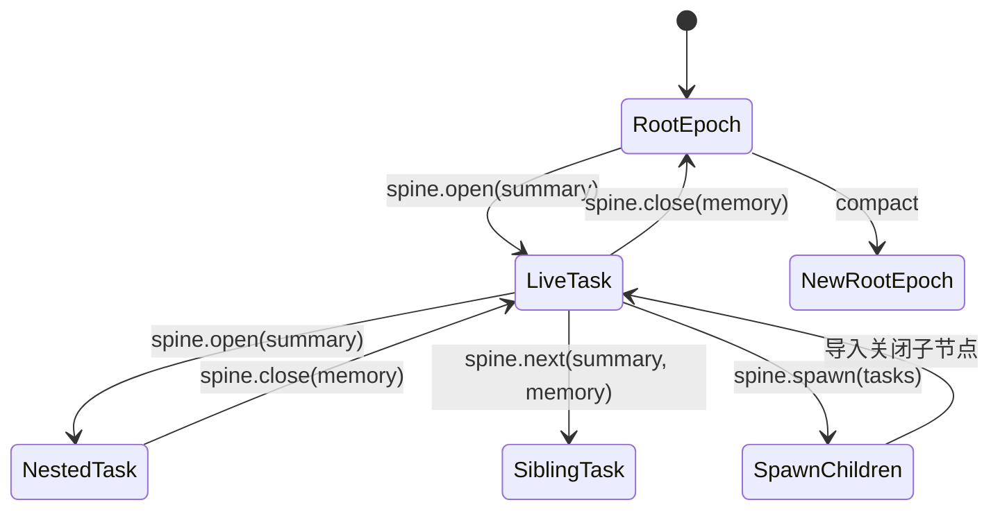
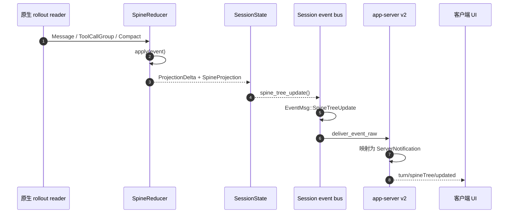
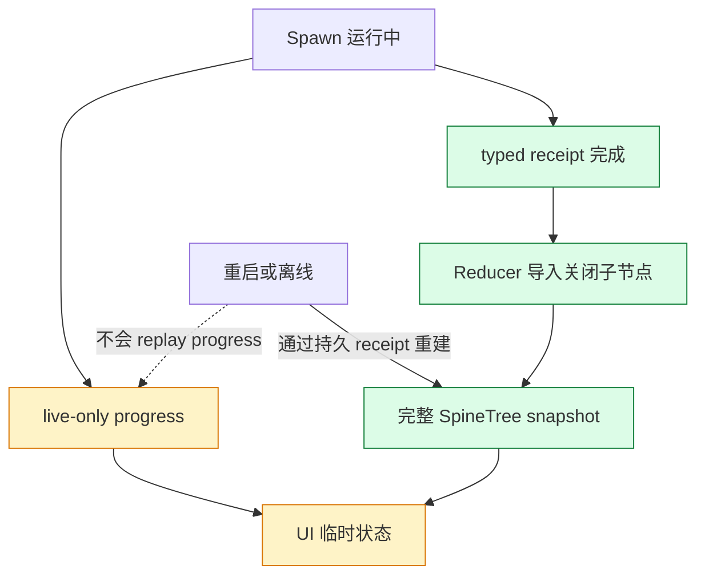

# 02 · SpineJIT 与协议数据流

## 02.1 核心模型

SpineJIT 的核心不是 UI，而是一个确定性的增量 reducer：输入原生 rollout 事件，维护当前 cursor、节点、边界和可见上下文，输出 `ProjectionDelta`。[reducer.rs:118](../../spinecodex-source-0.2.2/codex-rs/spine-core/src/reducer.rs#L118)

输入事件只有三类：

- 普通消息：追加到当前节点。
- 完整工具调用组：可能触发 `open`、`close`、`next`、`spawn`。
- compact：替换历史，并形成新的 Root Epoch 边界。

只有 `group.is_complete()` 的工具组才会结算 Spawn call id；不完整或非法的控制调用作为普通工具记录保留，不改变树结构。[reducer.rs:159](../../spinecodex-source-0.2.2/codex-rs/spine-core/src/reducer.rs#L159)

## 02.2 控制操作状态机



各操作的不变量如下：

| 操作 | 树变化 | Cursor 变化 | Memory |
|---|---|---|---|
| `open` | 当前节点新增 task 子节点 | 移到新子节点 | 无 |
| `close` | 当前 task 标记 closed | 回到父节点 | 组装模型 memory 与来源 span |
| `next` | 关闭当前 task，并新建同级 task | 移到新同级节点 | 旧节点生成 memory |
| `spawn` | 导入一个或多个关闭子节点 | 保持在父节点 | 每个子节点保存 outcome/diagnostic/execution ref |

`open` 的实现会生成父节点下一个 ordinal，并把 child 同时写入 `children` 与 `entries`，然后移动 cursor。[reducer.rs:183](../../spinecodex-source-0.2.2/codex-rs/spine-core/src/reducer.rs#L183)

`close` 会调用 `assemble_memory()`，写入 closed 状态和 end boundary，再恢复父节点 live 状态。[reducer.rs:209](../../spinecodex-source-0.2.2/codex-rs/spine-core/src/reducer.rs#L209)

`next` 将关闭和创建同级节点合并为一个原子转换，避免 UI 观察到 cursor 暂时回父节点的中间态。[reducer.rs:235](../../spinecodex-source-0.2.2/codex-rs/spine-core/src/reducer.rs#L235)

`spawn` 从 typed receipt 导入结果，生成关闭的子节点和 `SpawnEvidence` memory slot。[reducer.rs:278](../../spinecodex-source-0.2.2/codex-rs/spine-core/src/reducer.rs#L278)

## 02.3 从 rollout 到 app-server 通知



Session 在需要的边界调用 `emit_spine_tree_update()`：锁定状态、取得 snapshot，并投递 `EventMsg::SpineTreeUpdate`。[session/mod.rs:2114](../../spinecodex-source-0.2.2/codex-rs/core/src/session/mod.rs#L2114)

app-server 协议层把内部事件映射为 wire method：

- `turn/spineTree/updated`
- `turn/spineSpawnProgress/updated`，当前标记 experimental
- `rawResponseItem/completed`，内部用途但桌面 renderer 也消费

方法名定义在 [common.rs:1642](../../spinecodex-source-0.2.2/codex-rs/app-server-protocol/src/protocol/common.rs#L1642)。

## 02.4 通知字段

`SpineTreeUpdatedNotification` 是可重建 UI 的完整快照，不是 diff：[turn.rs:422](../../spinecodex-source-0.2.2/codex-rs/app-server-protocol/src/protocol/v2/turn.rs#L422)

```json
{
  "method": "turn/spineTree/updated",
  "params": {
    "threadId": "thread-123",
    "turnId": "turn-456",
    "snapshotSeq": 17,
    "activeNodeId": "1.2",
    "nodes": [],
    "settledSpawnCallIds": []
  }
}
```

每个 `SpineTreeNode` 包含 `nodeId`、`parentId`、kind、status、summary、memorySummary、spawnOutcome、start/end 和 contextPressure。[turn.rs:458](../../spinecodex-source-0.2.2/codex-rs/app-server-protocol/src/protocol/v2/turn.rs#L458)

伴生扩展应使用 `(threadId, turnId, snapshotSeq)` 作为幂等键；同一 thread 只接受更大的 `snapshotSeq`，不能按消息到达顺序盲目覆盖。

Spawn 进度包含 `callId` 与任务数组，每个任务有 ordinal、summary、child thread id、agent path 和状态。[turn.rs:437](../../spinecodex-source-0.2.2/codex-rs/app-server-protocol/src/protocol/v2/turn.rs#L437)

```json
{
  "method": "turn/spineSpawnProgress/updated",
  "params": {
    "threadId": "thread-123",
    "turnId": "turn-456",
    "callId": "call-789",
    "tasks": [
      {
        "ordinal": 0,
        "summary": "分析协议",
        "threadId": "child-thread",
        "agentPath": null,
        "status": "running"
      }
    ]
  }
}
```

## 02.5 持久化语义

Spawn progress 是 live-only：它通过 `deliver_event_raw` 直接送给在线客户端，不追加到父 rollout；最终持久事实来自完成后的 typed receipt。[session/mod.rs:2129](../../spinecodex-source-0.2.2/codex-rs/core/src/session/mod.rs#L2129)



因此 VS Code 侧需要两阶段合并：先显示 progress 临时节点；一旦新的 tree snapshot 的 `settledSpawnCallIds` 包含对应 call id，就删除临时状态，以 snapshot 为准。

## 02.6 当前桌面消费者

桌面 `ingest()` 识别 notification envelope，并将 Tree、Spawn progress 与 raw response item 分发到不同处理器。[spine-view.js:5419](../spine-view.js#L5419)

Tree snapshot 先通过 `normalizeSnapshot()` 进行：

- 类型和必填字段校验。
- 节点数量、文本长度与 memory summary 裁剪。
- 缓存时间戳和版本归一化。
- 旧缓存兼容和 TTL 清理。

随后 `projectSnapshot()` 生成 UI 行，最多 300 行，并限制可见 sibling 数量。[spine-view.js:2107](../spine-view.js#L2107)

VS Code 适配可以迁移“纯数据归一化和投影”逻辑，但应把它提取成无 DOM 的 TypeScript 模块，并为通知 fixture 做单元测试；不能直接 import 现有 IIFE renderer。

## 02.7 建议的伴生桥接协议

伴生代理不应改写官方 stdout JSONL。它只把白名单通知复制到本地 IPC，增加一个外层 envelope：

```json
{
  "bridgeVersion": 1,
  "sourcePid": 12345,
  "receivedAt": 1786694400000,
  "message": {
    "method": "turn/spineTree/updated",
    "params": {}
  }
}
```

硬边界建议：

- 只复制三个已知 method，默认不复制普通对话内容。
- 单行最大 2 MiB，超限只记录诊断，不写 IPC。
- Unix domain socket 权限 `0600`；Windows Named Pipe 只允许当前用户 SID。
- 连接前做 `bridgeVersion` 与随机 capability token 握手。
- IPC 不可用时代理仍继续转发 app-server，不能拖垮官方扩展。
- 不在日志中打印 token、prompt、memorySummary 或完整通知。

## 02.8 已知缺陷 / 改进建议

| 维度 | 当前 | 建议 |
|---|---|---|
| 协议稳定性 | Spawn progress 标为 experimental | 版本握手并允许缺失该通知 |
| raw response | `rawResponseItem/completed` 是 internal-only | MVP 不依赖它完成核心树展示 |
| 快照体积 | 完整 nodes 数组可能较大 | IPC 设硬上限、客户端去重和节流 |
| 断线恢复 | progress 不 replay | 以最新完整 tree snapshot 收敛 |
| 代码复用 | 当前投影逻辑与 DOM 混在 IIFE | 提取纯函数包并共享 fixture，不复制整份 renderer |

## 下一步

- 把通知流落到 VS Code：读 [03 VS Code 适配方案](./03-VS-Code适配方案.md)。
- 了解 VSIX 与发布门槛：读 [04 插件市场发布指南](./04-插件市场发布指南.md)。

