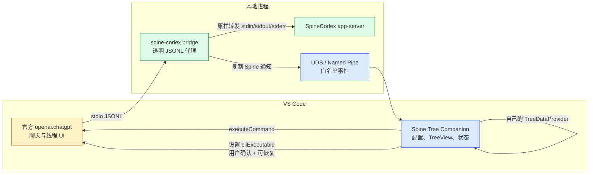
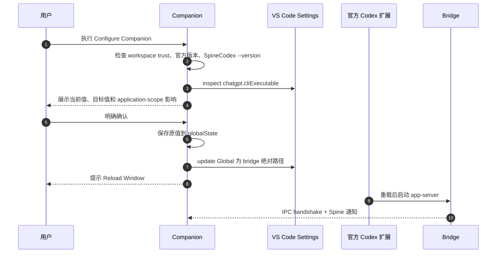
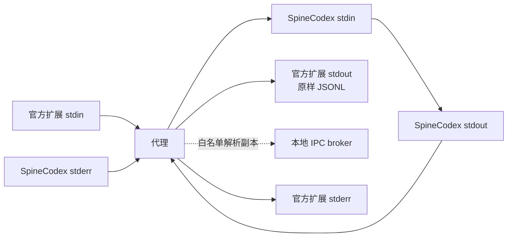

# 03 · VS Code 适配方案

## 03.1 结论与边界

可以通过另一个 VS Code 扩展“伴生”官方 Codex 扩展，但“封装”应理解为组合公开命令、配置后端入口和增加独立视图，不是把官方扩展嵌入、继承或重新打包。

本机官方扩展静态检查对象：

```text
扩展 ID: openai.chatgpt
版本: 26.810.41047
入口: ./out/extension.js
VS Code: ^1.96.2
```

清单公开贡献了 `chatgpt.openSidebar`、`chatgpt.openCommandMenu`、`chatgpt.newCodexPanel`、`chatgpt.addToThread` 和 `chatgpt.addFileToThread` 等命令。VS Code 官方文档允许其他扩展通过 `vscode.commands.executeCommand()` 调用贡献命令。

同一清单的 `chatgpt.cliExecutable` 描述明确写着：`DEVELOPMENT ONLY`、手动设置后部分功能可能异常；它的 scope 是 `application`，并标记 `restricted: true`。这说明它可以作为 PoC 接入点，但不能当作公开稳定 API。

官方 OpenAI 文档还确认：

- [Codex IDE extension](https://learn.chatgpt.com/docs/codex/ide) 是编辑器集成。
- [Codex App Server](https://learn.chatgpt.com/docs/app-server#protocol) 使用双向 JSON-RPC；stdio 默认是换行分隔 JSON，另有 Unix socket 与实验性 WebSocket transport。
- [Open-source components](https://learn.chatgpt.com/docs/open-source#open-source-components) 将 IDE extension 标为非开源，而 app-server 源码位于 Codex 仓库。

## 03.2 能用和不能用的官方扩展表面

| 表面 | 可用性 | 用法 |
|---|---|---|
| `extensionDependencies` | 稳定 VS Code manifest 能力 | 保证 `openai.chatgpt` 是依赖，不授予私有访问权 |
| 贡献命令 | 可用 | `executeCommand("chatgpt.openSidebar")` |
| `chatgpt.cliExecutable` | 可用但明确为开发态 | 仅在用户确认后写全局值，并提供恢复 |
| `extensions.getExtension(...).exports` | 原理上可用 | 仅当目标扩展的 `activate()` 返回并承诺公开对象；当前未发现受支持 API 文档 |
| 官方 Webview DOM | 不可用 | Webview 进程与 CSP 隔离，第三方无稳定入口 |
| 官方 app-server stdout | 不可直接订阅 | 子进程由官方扩展拥有，第三方 Extension Host 无法截获 |
| 修改官方安装目录 | 禁止作为方案 | 更新会覆盖，安全与 Marketplace 风险高 |
| 重新打包官方 VSIX/bundle/图标 | 不应做 | 官方扩展未开源，许可证文件只指向 OpenAI Terms |

`extensionDependencies` 和 `extensionPack` 不是一回事：前者表示运行时依赖，后者只是一组可一起安装的扩展。该方案必须用前者。

## 03.3 方案比较

| 方案 | 官方聊天 UI | Spine Tree | 稳定性 | 工作量 | 建议 |
|---|---|---|---|---|---|
| A. 注入官方 Webview | 保留 | 嵌入 | 极低 | 中 | 不做 |
| B. 伴生扩展 + CLI 透明代理 | 保留 | 独立视图 | 中，受 dev setting 影响 | 中 | MVP 推荐 |
| C. 修改 SpineCodex 增加固定旁路 | 保留 | 独立视图 | 中 | 中到高 | 代理验证后再评估 |
| D. 独立 app-server 客户端 | 自己实现 | 自己实现 | 高，基于官方协议 | 高 | 长期路线 |
| E. 重发官方扩展 | 看似保留 | 可改 | 法务和更新风险极高 | 高 | 禁止 |

方案 B 最符合现有代码：当前 shim 已经位于官方客户端与 SpineCodex 之间，只是使用 `stdio: "inherit"` 透明转发。[bin/spine-codex.mjs:17](../bin/spine-codex.mjs#L17) 把它升级为“转发 + 白名单镜像”即可，无需先改 reducer 或 app-server 协议。

## 03.4 推荐架构



这个架构不要求官方扩展提供线程订阅 API。官方扩展看到的 stdout 与原来一致，伴生扩展只接收代理复制的 Spine 通知。

## 03.5 建议目录

```text
spinecodex-vscode-companion/
├── package.json
├── package-lock.json
├── tsconfig.json
├── esbuild.mjs
├── src/
│   ├── extension.ts
│   ├── officialCodex.ts
│   ├── configuration.ts
│   ├── bridgeClient.ts
│   ├── protocol.ts
│   └── tree/
│       ├── model.ts
│       ├── projection.ts
│       └── provider.ts
├── bridge/
│   ├── proxy.mjs
│   └── native/
│       ├── darwin-arm64/spine-codex-bridge
│       ├── darwin-x64/spine-codex-bridge
│       └── win32-x64/spine-codex-bridge.exe
├── resources/
│   └── icon.png
├── test/
│   ├── fixtures/
│   ├── projection.test.ts
│   └── proxy.test.ts
├── README.md
├── CHANGELOG.md
├── LICENSE
├── PRIVACY.md
└── .vscodeignore
```

MVP 可以先只支持 macOS 本地，通过带 shebang 的代理启动；准备上 Marketplace 前应改成平台二进制或分别发布 platform-specific VSIX，避免 Windows 对脚本入口的差异。

## 03.6 `package.json` 核心片段

```json
{
  "name": "spinecodex-companion",
  "displayName": "Spine Tree Companion",
  "description": "A companion tree view for an external SpineCodex installation.",
  "publisher": "your-publisher",
  "version": "0.1.0",
  "license": "Apache-2.0",
  "engines": {
    "vscode": "^1.96.2"
  },
  "main": "./dist/extension.js",
  "extensionKind": ["workspace"],
  "extensionDependencies": ["openai.chatgpt"],
  "capabilities": {
    "untrustedWorkspaces": {
      "supported": false
    }
  },
  "activationEvents": [
    "onView:spineCodex.tree",
    "onCommand:spineCodex.configure",
    "onCommand:spineCodex.restoreOfficialCli"
  ],
  "contributes": {
    "viewsContainers": {
      "activitybar": [
        {
          "id": "spineCodex",
          "title": "Spine Tree",
          "icon": "resources/tree.svg"
        }
      ]
    },
    "views": {
      "spineCodex": [
        {
          "id": "spineCodex.tree",
          "name": "Tasks"
        }
      ]
    },
    "commands": [
      {
        "command": "spineCodex.configure",
        "title": "SpineCodex: Configure Companion"
      },
      {
        "command": "spineCodex.openOfficialSidebar",
        "title": "SpineCodex: Open Codex Sidebar"
      },
      {
        "command": "spineCodex.restoreOfficialCli",
        "title": "SpineCodex: Restore Official CLI"
      }
    ],
    "configuration": {
      "title": "SpineCodex Companion",
      "properties": {
        "spineCodex.binaryPath": {
          "type": ["string", "null"],
          "default": null,
          "scope": "application",
          "description": "Absolute path to an external SpineCodex executable."
        }
      }
    }
  }
}
```

活动栏 icon 可以用自有 SVG，因为它是 VS Code 产品 UI 资源；Marketplace 顶部 `icon` 字段必须使用至少 128×128 的 PNG，不能填 SVG。

打开官方侧栏只调用贡献命令，不读取目标扩展内部对象：

```ts
await vscode.commands.executeCommand("chatgpt.openSidebar");
```

## 03.7 配置官方 CLI 的安全流程

不能在扩展激活时静默改全局设置。建议流程：



关键代码骨架：

```ts
import * as vscode from "vscode";

const OFFICIAL_ID = "openai.chatgpt";
const CLI_SETTING = "cliExecutable";

export async function configureOfficialCli(
  context: vscode.ExtensionContext,
  bridgePath: string,
): Promise<void> {
  if (!vscode.workspace.isTrusted) {
    throw new Error("Trust this workspace before changing the Codex CLI path.");
  }

  const official = vscode.extensions.getExtension(OFFICIAL_ID);
  if (!official) {
    throw new Error("The OpenAI Codex extension is not installed.");
  }

  const config = vscode.workspace.getConfiguration("chatgpt");
  const inspected = config.inspect<string | null>(CLI_SETTING);
  const previous = inspected?.globalValue ?? null;
  const accepted = await vscode.window.showWarningMessage(
    "This changes the application-wide Codex CLI path and requires Reload Window.",
    { modal: true },
    "Configure",
  );
  if (accepted !== "Configure") return;

  await context.globalState.update("previousChatgptCliExecutable", previous);
  await config.update(
    CLI_SETTING,
    bridgePath,
    vscode.ConfigurationTarget.Global,
  );
}
```

恢复命令必须把原值写回，而不是简单设为 `null`，因为用户可能原本就在开发另一份 Codex CLI。

## 03.8 透明代理要求

代理接收官方扩展给 CLI 的全部参数，例如 `-c features.code_mode_host=true app-server --analytics-default-enabled`，并原样传给外部 SpineCodex。它必须满足：

- parent stdin → child stdin，保持背压。
- child stdout → parent stdout，保持 JSONL 顺序和内容。
- child stderr → parent stderr，不混入 stdout。
- 同时对 stdout 做旁路逐行解析；解析失败只影响镜像，不影响转发。
- 子进程退出码和 signal 正确传播。
- SIGINT/SIGTERM 和父进程断开时清理 child。
- broker 不存在、断线或背压时丢弃旁路事件并记录有界诊断，不能阻塞官方 app-server。



## 03.9 TreeView 数据策略

TreeView 以 `threadId` 分桶，每桶保存：

- 最新 `snapshotSeq`。
- 规范化节点 Map。
- 当前 active node。
- 按 call id 保存的临时 Spawn progress。
- 最近更新时间和来源进程。

更新规则：

1. 小于等于当前 `snapshotSeq` 的 Tree 通知丢弃。
2. 新 snapshot 到达时原子替换节点 Map。
3. `settledSpawnCallIds` 命中时清除对应 progress。
4. IPC 断开显示 stale 状态，不删除最后快照。
5. 默认只持久化节点摘要，不持久化完整 memory；提供 Clear Cache 命令。

节点点击应打开自有只读详情 Webview 或 QuickPick。不要尝试定位并操作官方 Webview 内部线程。

## 03.10 分阶段实施

### PoC 0：能力验证

- 只支持 macOS 本地 VS Code Stable。
- 扩展检测 `openai.chatgpt` 版本。
- 手动命令配置 `chatgpt.cliExecutable`。
- 代理只镜像 `turn/spineTree/updated`。
- TreeView 显示 node id、summary、status。
- 验证恢复命令和官方扩展升级后的失败行为。

### MVP 1：可发布预览版

- 加入 Spawn progress 合并、缓存上限、诊断日志。
- macOS arm64/x64 与 Windows x64 平台包。
- 平台 IPC 权限、capability token、自动重连。
- 兼容矩阵与清晰的 Preview 标识。
- VSIX 内容审计，不包含官方扩展文件或资产。

### 稳定版 2：降低私有依赖

- 向官方请求公开后端选择或事件订阅 API。
- 若不可得，评估独立 app-server 客户端。
- Remote-SSH、Codespaces、WSL 分别建真机测试矩阵。

## 03.11 PoC 验收清单

| 场景 | 验收标准 |
|---|---|
| 官方扩展未安装 | 依赖安装提示明确，不崩溃 |
| SpineCodex 路径无效 | 配置前阻止写入，显示 `--version` 错误 |
| 原值已自定义 | 显示差异，用户取消时零改动 |
| 重载后启动 | 官方聊天可正常建立线程和执行 turn |
| Tree 更新 | `snapshotSeq` 单调，节点状态正确 |
| Spawn 中断 | 临时状态最终由完整 snapshot 收敛 |
| Broker 崩溃 | 官方聊天不受影响，代理继续转发 |
| Restore | 恢复精确原值并重载后回到官方 CLI |
| 官方扩展升级 | 不兼容时停止配置并给出版本说明，不静默继续 |
| 卸载伴生扩展 | 提醒恢复设置，不能留下失效 bridge 路径 |

## 03.12 已知缺陷 / 改进建议

| 维度 | 当前判断 | 建议 |
|---|---|---|
| `cliExecutable` | 开发态、application scope、restricted | Preview 标识、版本门禁、显式确认、精确恢复 |
| 扩展 API | 没有受支持的 Spine/线程 exports | 仅使用命令和自己的 IPC |
| Remote | 官方和伴生扩展可能运行在不同 Extension Host | v1 先本地；远端需单独设计 endpoint discovery |
| 多窗口 | 多个代理可能同时连接 broker | envelope 加 source pid/session id，并按 thread 去重 |
| 隐私 | Tree memory 可能含用户上下文 | 默认最小化持久化，文档化数据路径和清理命令 |
| 品牌 | 容易被误认为官方扩展 | 名称、图标、README 都声明 independent companion |

## 下一步

- 发布前所需文件和命令：读 [04 插件市场发布指南](./04-插件市场发布指南.md)。
- 回看事件字段和合并规则：读 [02 SpineJIT 与协议数据流](./02-SpineJIT与协议数据流.md)。
