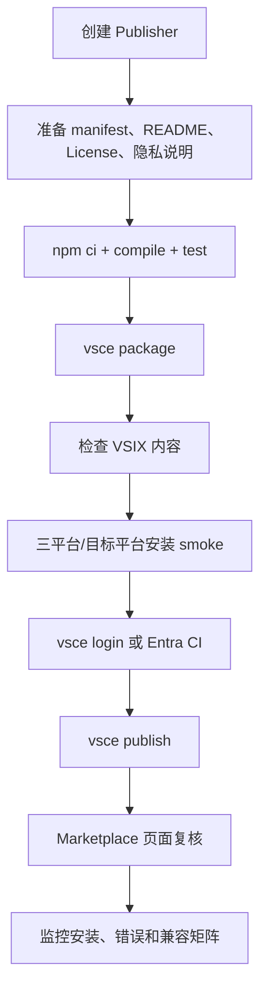
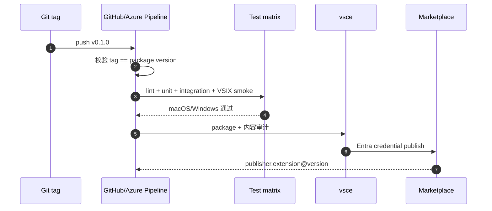

# 04 · 插件市场发布指南

## 04.1 发布对象

发布到 VS Code Marketplace 的应是一个全新、独立的 `spinecodex-companion` 扩展，不是当前 Electron DMG wrapper，也不是官方 `openai.chatgpt` 的二次打包。

扩展包可以包含：

- 自己编写的 Extension Host 代码。
- 自己编写的 TreeView/Webview 资源。
- 自己构建的透明代理二进制或脚本。
- 本项目 Apache-2.0 代码及其 NOTICE/许可证要求允许的部分。

扩展包不应包含：

- 官方 `openai.chatgpt` 的 `out/extension.js`、Webview bundle 或 `.vsixmanifest`。
- 官方 Codex 图标、名称视觉或其他可能暗示官方身份的资产。
- Codex Desktop、官方 Codex CLI 或用户本机 SpineCodex 二进制。
- token、会话缓存、调试日志或真实用户配置。

当前项目自身也遵循相同边界：发布脚本只复制 wrapper 文件与固定 Node runtime，[build-macos-release.mjs:91](../scripts/build-macos-release.mjs#L91)；第三方声明明确上游应用不随包分发，[THIRD_PARTY_NOTICES.md:3](../THIRD_PARTY_NOTICES.md#L3)。

## 04.2 Marketplace 前置条件

根据 [VS Code 官方 Publishing Extensions](https://code.visualstudio.com/api/working-with-extensions/publishing-extension)：

1. 准备 Microsoft/Azure DevOps 身份。
2. 在 Marketplace 管理页创建唯一 Publisher ID。
3. `package.json` 的 `publisher` 必须与 Publisher ID 完全一致。
4. 安装当前版 `@vscode/vsce`。
5. 本地打包并验证 VSIX，再发布。

截至 2026-08-14，官方文档仍说明本地交互发布可使用 Azure DevOps PAT，但同时公告 **global PAT 将在 2026-12-01 退役**，自动化发布推荐 Microsoft Entra ID、workload identity federation 或 managed identity。因此：

- 本地首次发布可以按 PAT 流程验证。
- 新建 CI 不应存长期 PAT，应直接按 Entra ID 方案设计。

若使用 PAT：

- Organization 选择 `All accessible organizations`。
- Scopes 选择 `Custom defined` → `Marketplace` → `Manage`。
- 使用最短合理有效期，不把 token 写进仓库、`.env` 或 workflow 明文。

## 04.3 发布流程



最短命令链：

```bash
npm install -g @vscode/vsce
vsce login <publisher-id>
vsce package
vsce publish
```

正式执行前应补上项目验证：

```bash
npm ci
npm run compile
npm test
vsce ls
vsce package
code --install-extension spinecodex-companion-0.1.0.vsix
```

`vsce publish` 会读取 `package.json` 的版本。若执行 `vsce publish minor` 或指定版本，它会修改版本，并在 Git 仓库中可能通过 npm-version 创建 commit/tag；混合工作区中不建议直接使用自动改版本，优先手动更新、review diff、打包、再发布。

## 04.4 必备文件与 manifest 检查

| 文件 | 要求 |
|---|---|
| `package.json` | 唯一 name、publisher、SemVer、`engines.vscode`、main、contributions、repository |
| `README.md` | 安装、配置、恢复官方 CLI、支持矩阵、非官方声明、截图 |
| `CHANGELOG.md` | 每个公开版本的行为变化与兼容性变化 |
| `LICENSE` | 自有扩展许可证；第三方代码另列 notice |
| `PRIVACY.md` | 本地 IPC、缓存字段、日志、遥测和清理方式 |
| `SECURITY.md` | 漏洞报告通道、IPC 边界、token 处理 |
| `.vscodeignore` | 排除源码、测试、fixture、缓存、密钥和无关平台二进制 |
| `resources/icon.png` | 至少 128×128，建议 256×256；Marketplace icon 不能是 SVG |

建议 manifest 还包括：

```json
{
  "preview": true,
  "categories": ["Visualization", "Other"],
  "keywords": ["spine", "task tree", "codex", "companion"],
  "repository": {
    "type": "git",
    "url": "https://github.com/<org>/<repo>.git"
  },
  "bugs": {
    "url": "https://github.com/<org>/<repo>/issues"
  },
  "homepage": "https://github.com/<org>/<repo>#readme"
}
```

VS Code Marketplace 目前限制最多 30 个 keywords；README/CHANGELOG 中图片应使用 HTTPS，用户提供的 SVG 不能作为 Marketplace 发布内容，icon 必须是 PNG。

## 04.5 `.vscodeignore` 示例

```gitignore
.github/**
.vscode/**
src/**
test/**
coverage/**
*.map
*.log
.env*
!dist/**
!bridge/native/${target}/**
```

实际 `.vscodeignore` 不能直接使用上面的 `${target}` 占位符；platform-specific 构建应在打包前生成精确清单，或按平台使用不同 staging 目录。

打包后至少运行：

```bash
unzip -l spinecodex-companion-0.1.0.vsix
```

人工确认没有：`.env`、PAT、用户路径、会话 JSONL、官方扩展 bundle、其他平台大文件、源码 map 和测试私有 fixture。

## 04.6 平台包策略

若 bridge 是纯 TypeScript 且不依赖 native module，可以发布一个通用 VSIX。若包含本地代理二进制，推荐使用 platform-specific extension：

```bash
vsce package --target darwin-arm64
vsce package --target darwin-x64
vsce package --target win32-x64
```

发布已生成包：

```bash
vsce publish --packagePath <path-to-vsix>
```

每个平台都必须验证：

- bridge 能被 `chatgpt.cliExecutable` 直接启动。
- 子进程退出码、信号、stdin/stdout 背压正确。
- UDS/Named Pipe 仅当前用户可访问。
- VS Code Stable 和目标最低版本均可激活。
- 卸载或禁用后，恢复命令不会依赖已删除的 bridge。

## 04.7 CI 发布建议

当前 Electron wrapper 的 CI 可以作为质量门模板：它固定 Node 22.23.2，使用 `npm ci --ignore-scripts`，再执行完整检查。[ci.yml:15](../.github/workflows/ci.yml#L15)

当前 macOS release workflow 还展示了值得保留的发布顺序：

1. 标签与源码版本一致。
2. 完整测试通过。
3. 产物与 SHA-256 验证通过。
4. 检查未打包上游应用。
5. 先创建 draft release，上传完成后再公开。[release.yml:99](../.github/workflows/release.yml#L99)

VSIX CI 建议采用类似门禁：



新建自动发布流水线应优先使用官方推荐的 Entra ID workload identity，而不是新增长期 PAT secret。若团队暂时只能使用 PAT，至少使用短有效期、环境保护、最小 Marketplace Manage scope 和人工审批。

## 04.8 品牌、授权与隐私

建议 Marketplace 名称使用 `Spine Tree Companion` 或 `SpineCodex Companion`，不要使用 `Official Codex`、仿官方图标或让用户误认为由 OpenAI 发布。

README 首屏应明确：

```text
Independent companion extension. Not affiliated with or endorsed by OpenAI.
Requires the official OpenAI Codex extension and an external SpineCodex installation.
```

本机官方扩展的 `LICENSE.md` 只指向 OpenAI Terms of Use；这不构成将其 bundle、图标或 Webview 复制到第三方 VSIX 的明确许可。发布前如需使用 OpenAI 商标或官方视觉资产，应取得单独授权。

隐私说明至少覆盖：

- 读取的设置键和值是否保存。
- IPC endpoint、token 和权限。
- Tree snapshot 中保存哪些字段、保存多久、如何清除。
- 是否有遥测，默认是否关闭，数据发送到哪里。
- 日志如何脱敏，不记录 prompt、memory、token 和源码正文。

## 04.9 发布前验收

| 检查 | 通过标准 |
|---|---|
| 源码状态 | `git diff` 只有目标扩展与文档变化 |
| 版本 | tag、package version、CHANGELOG 一致 |
| 编译 | clean checkout 下 `npm ci && npm run compile` 通过 |
| 测试 | 代理字节透明、Tree 投影、恢复设置和断线均有覆盖 |
| VSIX | `vsce package` 无警告或警告已审查 |
| 包内容 | 不含官方 bundle、密钥、日志、用户配置和无关平台文件 |
| 安装 | clean VS Code profile 安装、激活、卸载通过 |
| 回滚 | Restore 恢复精确原值，官方扩展恢复正常 |
| 兼容 | 官方扩展支持版本范围与未知版本行为明确 |
| 品牌 | 独立名称、自有 PNG icon、非官方声明可见 |
| 隐私 | PRIVACY 和 Clear Cache 命令存在 |
| 发布凭证 | 本地短期 PAT 或 CI Entra ID，仓库无 secret |

## 04.10 失败与回滚

如果发布后发现官方扩展升级不兼容：

1. 立即把 Marketplace 版本标记为有问题并发布兼容修复；必要时下架该版本。
2. 伴生扩展在启动时阻止未知官方版本自动配置。
3. 提示用户执行 `SpineCodex: Restore Official CLI` 并 Reload Window。
4. 不要远程删除用户设置或静默覆盖其他 CLI 路径。
5. 保留旧 VSIX 与变更说明，便于复现。

VS Code 官方文档提醒：扩展名一旦从 Marketplace 删除会永久保留，不能重新使用；删除版本也不可逆，且不能删除最新版本。因此优先发布修复版本或 unpublish，避免仓促 remove。

## 04.11 已知缺陷 / 改进建议

| 维度 | 当前 | 建议 |
|---|---|---|
| 扩展产物 | 尚未实现真实 VSIX | 完成 PoC 后再创建 Publisher 和公开页面 |
| 自动发布 | PAT 流程短期可用但即将退役 | 新 CI 直接使用 Entra ID workload identity |
| Windows | 当前 wrapper workflow 明确禁用 | 不要据此宣称 VS Code bridge 已支持 Windows |
| 商标 | 项目名含 Codex | 页面显著标明 independent companion，使用自有视觉 |
| 协议 | 依赖 Spine 私有扩展通知 | Preview 阶段公布兼容矩阵和降级行为 |

## 下一步

- 实现前回到 [03 VS Code 适配方案](./03-VS-Code适配方案.md) 的 PoC 验收清单。
- 协议 fixture 以 [02 SpineJIT 与协议数据流](./02-SpineJIT与协议数据流.md) 的字段为准。

