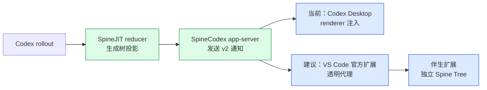

# SpineCodex App 源码与 VS Code 适配分析

> 基于 `spine-codex-app-fix` 与配套 `spinecodex-source-0.2.2` 在 2026-08-14 的源码核验。文档明确区分当前实现、建议方案与尚待 PoC 验证的假设。

## 直接结论

**可以适配 VS Code 的官方 Codex 扩展，但不应把桌面端的 Electron 注入方案原样移植，也不应重新打包官方扩展。**

推荐做一个独立的“Spine Tree Companion”伴生扩展：

1. 通过 `extensionDependencies: ["openai.chatgpt"]` 声明运行依赖。
2. 只调用官方扩展公开贡献的命令，例如 `chatgpt.openSidebar`。
3. 经用户确认后，把官方扩展的全局 `chatgpt.cliExecutable` 指向透明代理；代理继续启动 SpineCodex `app-server`。
4. 代理逐字节转发官方 JSONL，同时把 Spine 通知镜像到本地 IPC。
5. 伴生扩展使用自己的 `TreeView` 或 Webview 展示 Spine Tree，不进入官方 Webview，也不修改官方扩展安装目录。

这条路线能做出 MVP，但 `chatgpt.cliExecutable` 在官方清单中明确标记为 `DEVELOPMENT ONLY`，因此只能视为**兼容性接口**，不能视为长期稳定 API。长期稳定路线是做完整的独立 app-server 客户端。

## 结论分级

| 分级 | 结论 | 依据 |
|---|---|---|
| 已验证 | 当前项目是 Node.js/Electron 运行时外挂，不是 Codex UI fork | [spine-app.mjs:56](../spine-app.mjs#L56)、[spine-electron-main-hook.cjs:458](../spine-electron-main-hook.cjs#L458) |
| 已验证 | SpineJIT 在 Rust reducer 中将 rollout 增量归约为树投影 | [reducer.rs:118](../../spinecodex-source-0.2.2/codex-rs/spine-core/src/reducer.rs#L118) |
| 已验证 | Spine Tree 和 Spawn 进度已经进入 app-server v2 通知协议 | [common.rs:1642](../../spinecodex-source-0.2.2/codex-rs/app-server-protocol/src/protocol/common.rs#L1642) |
| 已验证 | 官方 VS Code 扩展使用 app-server，且本机扩展清单提供开发态 CLI 路径设置 | 本机 `openai.chatgpt-26.810.41047` 静态检查，见 [03 VS Code 适配方案](./03-VS-Code适配方案.md) |
| 建议方案 | 用独立伴生扩展、透明 JSONL 代理和独立 TreeView 适配 | [03 VS Code 适配方案](./03-VS-Code适配方案.md) |
| 需 PoC | 第三方扩展写入受限的 application-scope 设置后，当前 Stable/Remote 场景是否一致生效 | 需要 macOS、Windows、Remote-SSH 三组真机验证 |
| 不建议 | 注入官方 Webview、修改 Extension Host、复制官方 bundle/图标或重发官方 VSIX | 私有实现耦合、更新脆弱、授权和 Marketplace 风险 |

## 文档结构

| 章节 | 内容 |
|---|---|
| [01 架构与功能原理](./01-架构与功能原理.md) | 桌面外挂的启动、主进程修补、renderer 注入、缓存和安全边界 |
| [02 SpineJIT 与协议数据流](./02-SpineJIT与协议数据流.md) | reducer 状态转换、事件映射、通知字段和持久化语义 |
| [03 VS Code 适配方案](./03-VS-Code适配方案.md) | 官方扩展可用边界、伴生扩展架构、目录和关键代码骨架 |
| [04 插件市场发布指南](./04-插件市场发布指南.md) | manifest、VSIX、Publisher、鉴权、发布、合规和跨平台检查 |

## 系统一句话模型

重要边界是：Spine 的核心能力在 app-server 之前已经形成，桌面 UI 只是一个消费者。因此 VS Code 适配应该复用协议，不应该复用桌面端 DOM 注入。

## 核验范围

本次使用 Verify Tier 2：

- Node 项目图谱：`SpineCodexApp-local-20260814`，393 节点、1050 边，状态 `ready`。
- Rust 项目图谱：`SpineCodex-source-0.2.2-local`，88663 节点、565444 边，状态 `ready`。
- 构建脚本、测试、workflow、扩展清单等非图谱文件使用逐行源码读取补证。
- `npm run check` 已通过：15 个 Node 测试全部通过，renderer 与 SSH 契约检查通过。

## 阅读建议

- 想先判断“能不能做”：直接读 [03 VS Code 适配方案](./03-VS-Code适配方案.md)。
- 想理解为什么桌面方案不能照搬：读 [01 架构与功能原理](./01-架构与功能原理.md)。
- 想实现事件代理和 TreeView：先读 [02 SpineJIT 与协议数据流](./02-SpineJIT与协议数据流.md)，再读 03。
- 想发布 VSIX：读 [04 插件市场发布指南](./04-插件市场发布指南.md)。

## 已知缺陷 / 改进建议

| 维度 | 当前证据 | 建议 |
|---|---|---|
| 官方扩展兼容 | 本机版本 `26.810.41047` 的静态检查 | 建立最低/最高兼容版本矩阵，不宣称永久兼容 |
| 远程开发 | 已验证桌面 SSH，不等于 VS Code Remote-SSH | MVP 先限定本地，再做远端 Extension Host PoC |
| Marketplace | 发布流程已有官方依据，尚无伴生扩展实包 | 在发布前生成 VSIX 并检查包内容与三平台启动 |
| 法务/品牌 | 已确认官方扩展未提供可重打包许可 | 使用独立名称、独立图标、非官方免责声明，不复制官方资产 |

