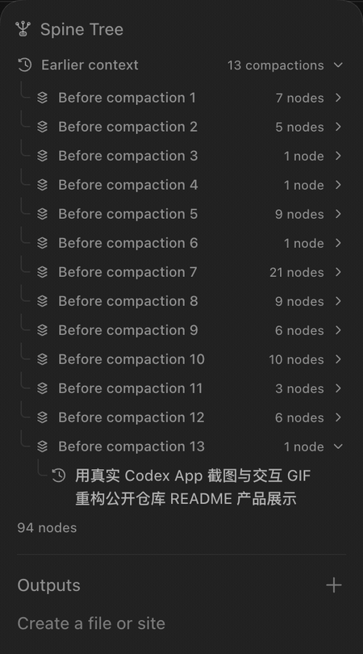
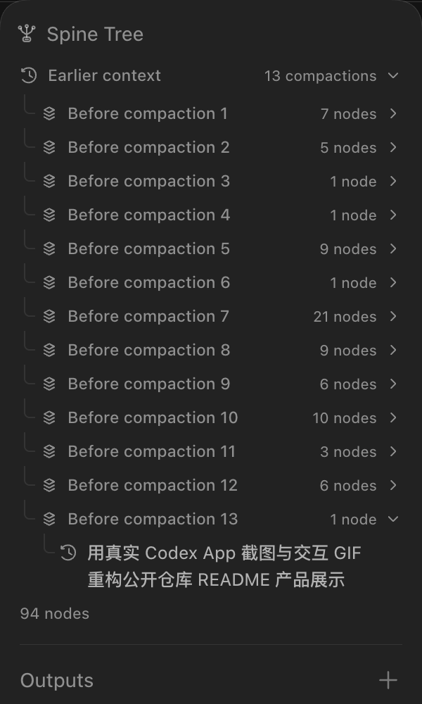
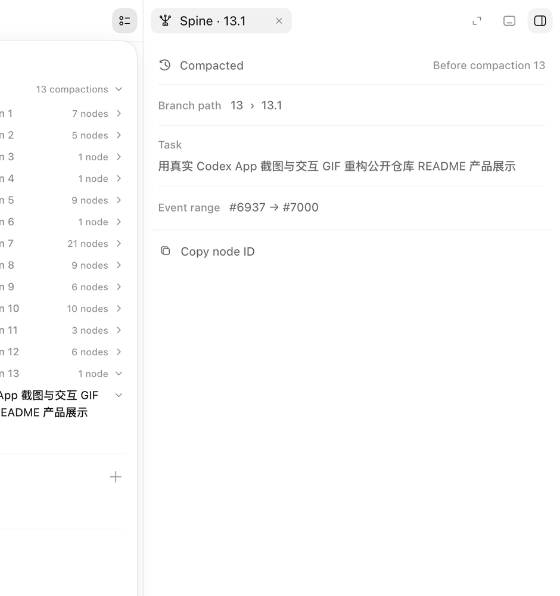
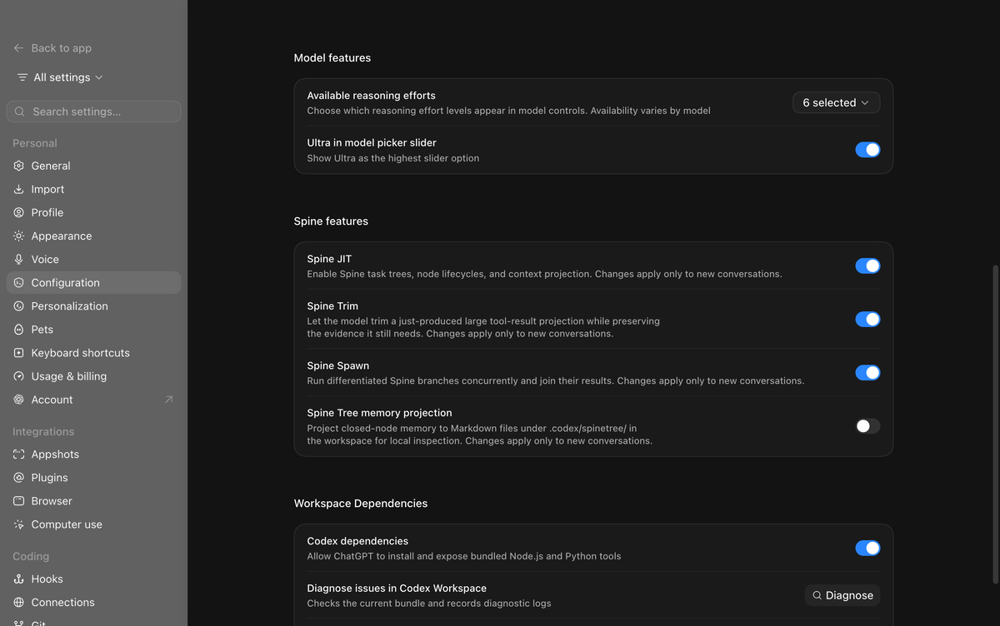

<p align="center">
  
</p>

<h1 align="center">SpineCodex App</h1>

<p align="center">
  <strong>See the Spine. Keep the Codex experience.</strong><br>
  A lightweight macOS launcher that brings an interactive Spine Tree into the native Codex Desktop interface.
</p>

<p align="center">
  <a href="https://github.com/izumedonabe/spine-codex-app/releases/tag/v0.2.1"></a>
  
  <a href="LICENSE"></a>
  
</p>

<p align="center">
  <a href="https://github.com/izumedonabe/spine-codex-app/releases/download/v0.2.1/SpineCodex-App-v0.2.1-macos-arm64.dmg"><strong>Download for Apple Silicon</strong></a>
  ·
  <a href="https://github.com/izumedonabe/spine-codex-app/releases/download/v0.2.1/SpineCodex-App-v0.2.1-macos-x64.dmg"><strong>Download for Intel Mac</strong></a>
  ·
  <a href="docs/FEATURES.md">Feature details</a>
</p>

<p align="center">
  
</p>

SpineCodex already gives long-running Codex tasks a real tree: task scopes, closed-node memory, compaction boundaries, and concurrent Spawn branches. SpineCodex App makes that structure visible and operable in the GUI without replacing Codex Desktop.

It embeds into both pinned and floating summary surfaces, opens node details in Codex's existing right workspace sidebar, and follows the App's language, colors, typography, disclosure motion, and reduced-motion preference.

## What it feels like

<table>
  <tr>
    <td width="50%" valign="top">
      <br>
      <strong>Native tree navigation</strong><br>
      Browse compaction history, task hierarchy, folded branches, and live status without leaving the conversation.
    </td>
    <td width="50%" valign="top">
      <br>
      <strong>Details where Codex puts details</strong><br>
      Inspect state, branch path, task summary, closed memory, context growth, event range, and Spawn links in the native right sidebar.
    </td>
  </tr>
</table>

<p align="center">
  
</p>

<p align="center"><sub>Spine feature controls live directly below Codex's Model features and are scoped independently for local and SSH hosts.</sub></p>

## Highlights

| | Capability | What it adds |
|---|---|---|
| 🌲 | Interactive Spine Tree | Current tasks, earlier context, compaction groups, closed subtrees, and stable folding state |
| 🔎 | Native node details | Clickable node and Spawn rows with memory, token-growth, event-range, and copy actions |
| ⚡ | Spine Spawn integration | Live branch state, task-based child-agent names, and direct navigation into child-agent history |
| 🖥️ | Local + SSH | Uses the installed SpineCodex locally and selects `spine-codex` through Codex's native SSH transport remotely |
| 🌐 | Codex-aware i18n | Automatically follows 10 Codex UI locales, including Simplified and Traditional Chinese |
| 🪶 | Event-driven renderer | No watchdog, polling loop, React Fiber scan, or permanent whole-page observer |

The full behavior, cache limits, UI contracts, and performance design are documented in [Feature details](docs/FEATURES.md).

## Install

### Requirements

- macOS 14 or newer
- The current [ChatGPT desktop app with Codex](https://chatgpt.com/download/)
- `spine-codex` 0.2.1 or newer, installed separately:

```sh
npm install -g @spinejit/spine-codex@latest
spine-codex --version
```

### From the DMG

1. Download the **arm64** DMG for Apple Silicon or the **x64** DMG for an Intel Mac.
2. Drag **SpineCodex App** to Applications.
3. Quit ChatGPT completely with **Command-Q**.
4. Open **SpineCodex App**.

The release DMGs contain only this wrapper and its private Node.js runtime. **Codex Desktop and SpineCodex are not bundled, downloaded, or installed.** If either dependency is missing, first run reports both requirements together and exits without changing your system.

The initial public build is ad-hoc signed because the project does not yet have a Developer ID certificate. If macOS blocks the first launch, right-click the app and choose **Open**, or allow it once in **System Settings → Privacy & Security**. SHA-256 checksum files are published beside both DMGs.

## Automatic discovery

No path setup is required in the normal case.

| Target | Discovery order |
|---|---|
| Codex Desktop | Standard `/Applications` and `~/Applications` locations, then Spotlight/Launch Services using `com.openai.codex` |
| Local SpineCodex | Explicit development override, environment, current/login-shell `PATH`, Homebrew, npm, Volta, and installed nvm versions |
| Remote SpineCodex | Each SSH host's login-shell `PATH`; the local executable path is never sent to the server |

Explicit `--app` and `--spine-codex` options remain available for development and troubleshooting. The built-in doctor aggregates all missing requirements instead of stopping at the first error:

```sh
./spine-app --diagnose
```

## How it works

```text
SpineCodex App
  ├─ launches the installed Codex Desktop app
  ├─ points local app-server startup at the installed spine-codex
  ├─ selects spine-codex for Codex's native SSH startup path
  └─ injects one small, event-driven renderer extension
       ├─ turn/spineTree/updated
       └─ turn/spineSpawnProgress/updated
```

The launcher does not modify `app.asar`, replace the Codex React tree, or patch the application on disk. Renderer integration uses a Shadow DOM surface and narrow structural hooks; version-sensitive main-process hooks fail closed when an unknown Codex bundle no longer matches.

See [SECURITY.md](SECURITY.md) for the trust boundary and [THIRD_PARTY_NOTICES.md](THIRD_PARTY_NOTICES.md) for bundled runtime notices.

## Source usage

```sh
git clone https://github.com/izumedonabe/spine-codex-app.git
cd spine-codex-app
./spine-app --diagnose
./spine-app
./spine-app /path/to/workspace
```

Source usage requires Node.js 22 or newer. Opening without a path launches the existing Codex interface; it does not create a task rooted at `/`. The launcher exits after registering the renderer, while Codex Desktop keeps running. After a full Codex restart, launch through SpineCodex App again.

## Versioning and compatibility

Release versions track the minimum supported SpineCodex release. This release is **v0.2.1** and requires SpineCodex 0.2.1 or newer. Version tracking does not mean SpineCodex is redistributed here.

The initial release was tested with ChatGPT/Codex Desktop build `26.727.40816`. Codex internals can change, so compatibility-sensitive hooks match narrow structural markers and fail closed instead of patching an unknown bundle.

## Build and verify

```sh
npm run check
npm run build:macos
```

The macOS build downloads pinned official Node.js arm64/x64 runtimes, verifies them against Node's published SHA-256 manifest, creates ad-hoc-signed App bundles, and emits architecture-specific DMGs plus checksum files under `dist/`. It never downloads SpineCodex or Codex Desktop.

Contributions are welcome; see [CONTRIBUTING.md](CONTRIBUTING.md).

## License

Apache-2.0. See [LICENSE](LICENSE) and [third-party notices](THIRD_PARTY_NOTICES.md).

<p align="center"><sub>Independent project. Not affiliated with or endorsed by OpenAI.</sub></p>
