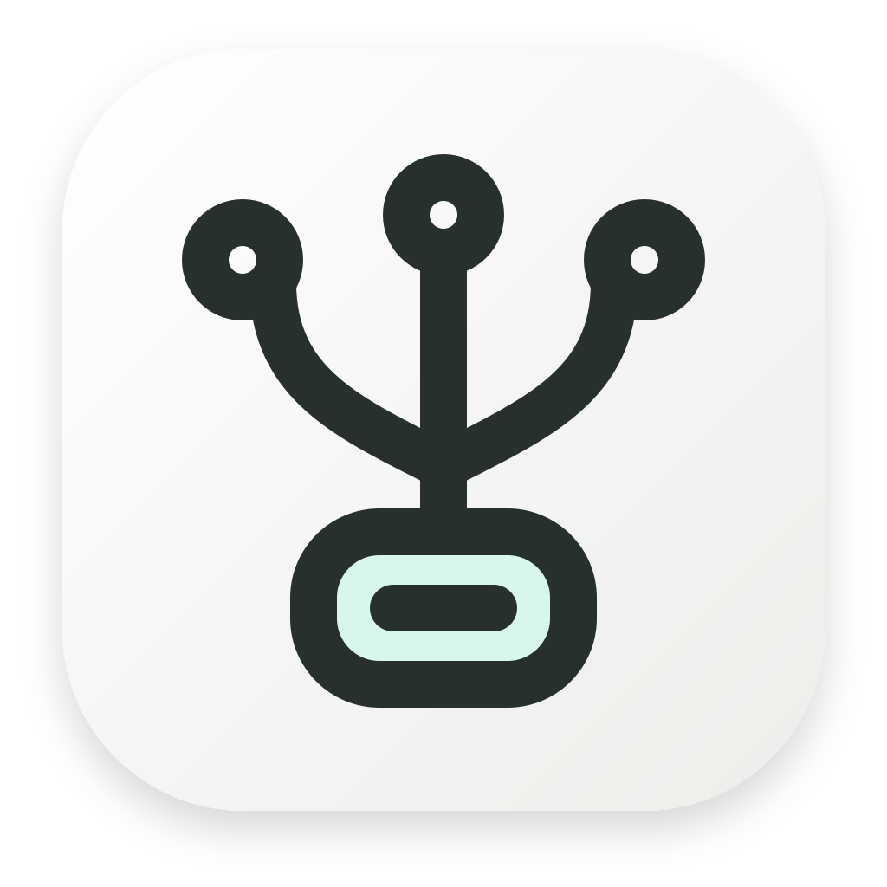
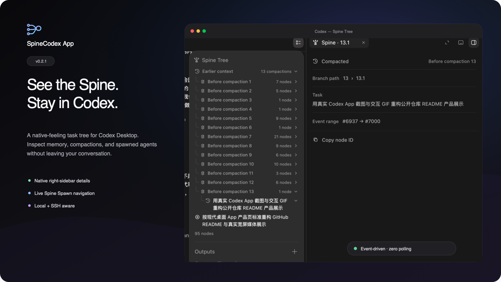
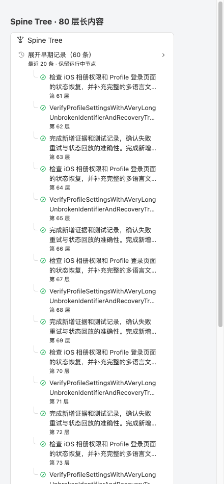
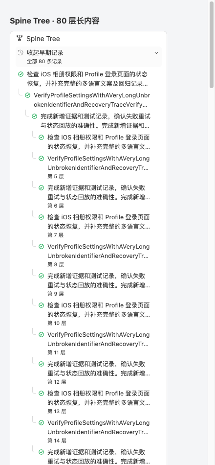
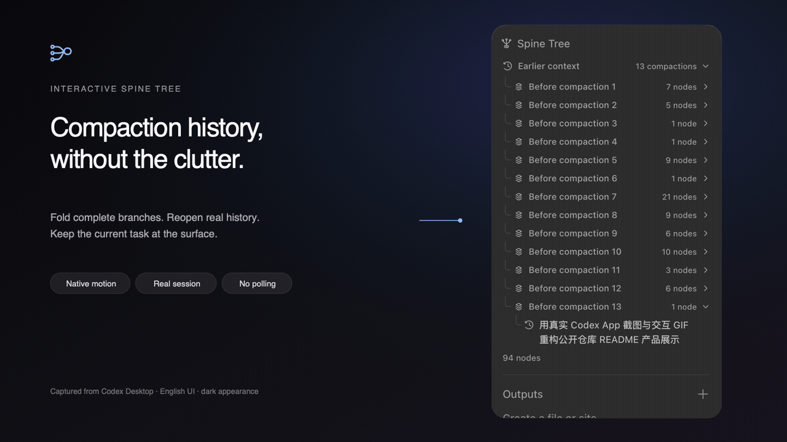
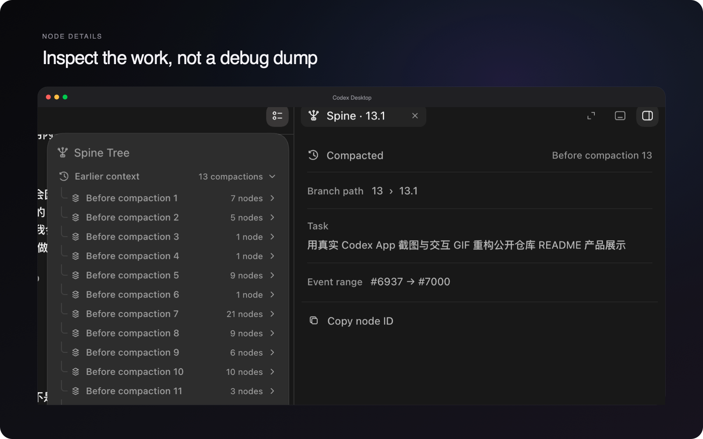
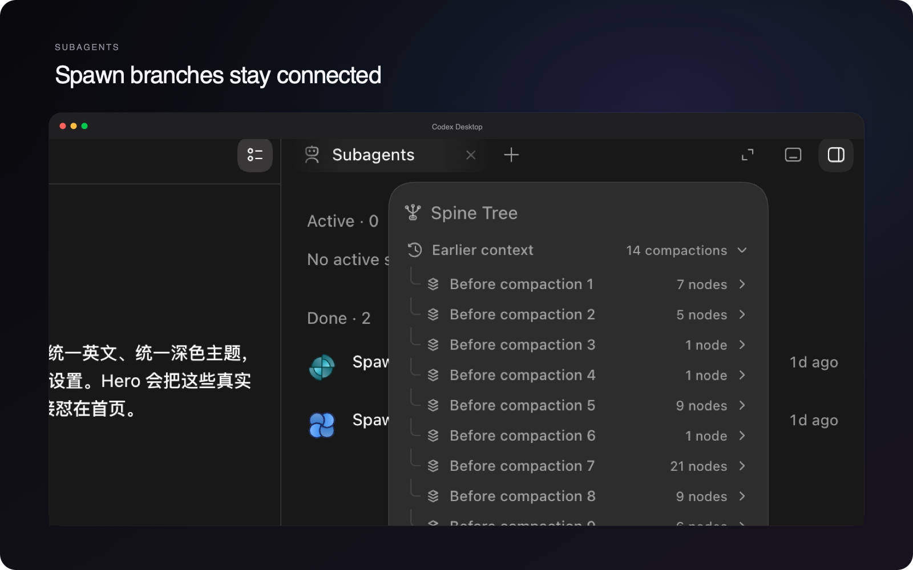
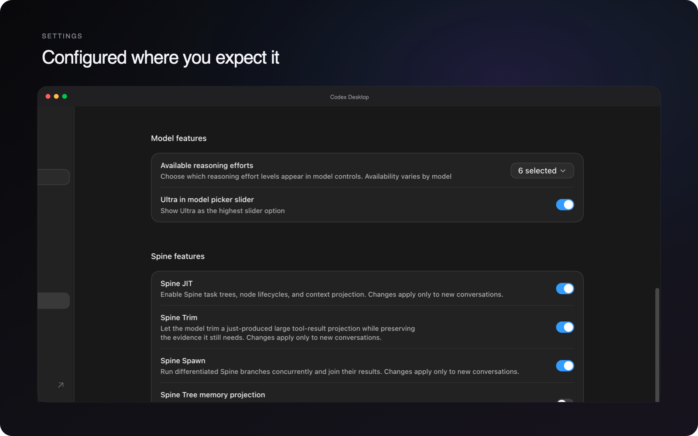

<p align="center">
  
</p>

<h1 align="center">SpineCodex App</h1>

<p align="center"><strong>简体中文</strong> · <a href="README.md">English</a></p>

<p align="center">
  <strong>让 Spine 融入 Codex。</strong><br>
  为 Codex Desktop 提供像原生功能一样自然的交互式任务树。
</p>

<p align="center">
  <a href="https://github.com/frui85/spine-codex-app/releases/tag/v26.901.51231.2"></a>
  
  
  <a href="LICENSE"></a>
  
</p>

<p align="center">
  <a href="https://github.com/frui85/spine-codex-app/releases/download/v26.901.51231.2/SpineCodex-App-v26.901.51231.2-macos-arm64.dmg"><strong>下载 Apple Silicon 版本</strong></a>
  &nbsp;·&nbsp;
  <a href="https://github.com/frui85/spine-codex-app/releases/download/v26.901.51231.2/SpineCodex-App-v26.901.51231.2-macos-x64.dmg"><strong>下载 Intel Mac 版本</strong></a>
  &nbsp;·&nbsp;
  <a href="docs/FEATURES_ZH.md">查看全部功能</a>
</p>

<br>



<br>

SpineCodex 已经为长时间运行的 Codex 工作提供了真实结构：有明确作用域的任务、关闭节点记忆、压缩边界，以及并发 Spawn 分支。**SpineCodex App 在不替代 Codex 使用体验的前提下，让这些结构可见、可操作。**

<table>
  <tr>
    <td width="33%" valign="top">
      <h3>追踪工作</h3>
      当前任务始终位于表层。更早的上下文按真实压缩边界分组，不再堆成无止境的对话记录。
    </td>
    <td width="33%" valign="top">
      <h3>检查记忆</h3>
      在 Codex 原生右侧工作区边栏中打开任意节点，查看其路径、摘要、关闭记忆、上下文增长和事件范围。
    </td>
    <td width="33%" valign="top">
      <h3>跟踪每个 Agent</h3>
      实时查看 Spine Spawn 分支，保留基于任务的 Agent 名称，并直接跳转到对应的子 Agent 历史记录。
    </td>
  </tr>
</table>

## 长任务树与早期记录

默认保留当前上下文投影末尾的 **20 条展示记录**，运行中、Spawn 进度及已选中项保持可见。点击“展开早期记录”查看被隐藏的记录，再次点击即可收起。它不代表 20 轮对话，也不会删除历史或触发上下文压缩；原有压缩分组、节点图标和操作含义保持不变。

深层缩进不超过 42px，窄面板按比例进一步收缩；标题最多两行，悬停查看规范化后的完整标题，点击任务仍打开原生详情。深层行附“第 N 层”，指展示层级，不是执行次数或压缩次数。

| 默认收起 | 展开早期记录 |
|---|---|
|  |  |

以上两图来自生产 Renderer 代码配合 80 层模拟数据的本地测试，不是真实会话截图。下方官方原始截图/GIF 保留用于介绍原生嵌入与节点语义，属于历史版本示例；其中旧版本号及“zero polling”不代表当前 App 全部运行模式。详细定义见[设计与官方语义核对](docs/SpineTree设计与官方语义核对_20260910.md)。

## 动态演示



<p align="center"><sub>真实 Codex Desktop 会话 · 英文界面 · 深色外观 · 非模拟产品界面</sub></p>

## 让细节出现在该出现的位置

点击任务后，其完整上下文会作为普通页面打开在 Codex 现有的右侧边栏中，而不是浮动的用户脚本卡片，也不会创建第二个边栏。



## Spawn 分支始终保持关联

实时 Spawn 进度会与最终关闭的 Spine 节点对齐。子 Agent 继承任务摘要作为显示名称，点击 **Open subagent** 可进入对应的 Codex 原生 Agent 历史。结构化 Spawn 意图会在进度开始前保存，因此即使父任务中断或 App 重启，任务名称仍能保留。



## 像原生功能一样配置

Spine 控件位于 Codex 的 Model features 下方。设置按主机隔离，因此本地环境与 SSH 连接环境分别保存自己的配置。标题会显示本地 SpineCodex 产品版本与 Codex 兼容版本；远程主机保持独立功能状态，不复用本地版本结论。



## 设计目标：融入 Codex

- **固定与浮动摘要**：同一棵任务树可挂载到两种原生摘要区域。
- **遵循 Codex 的语言和外观**：支持 10 种 App 语言，以及明暗配色、排版、动效变量和减少动态效果偏好。
- **树数据事件驱动**：不轮询任务数据，不扫描 React Fiber，也不永久观察整页。外部适配器模式另有每秒检查 Renderer target 的常驻 supervisor。
- **本地与远程一致**：本地启动已安装的 SpineCodex，远程通过 Codex 原生 SSH 传输选择 `spine-codex`。
- **有界且可回滚**：每个任务只保留最新快照，持久化有明确上限，不修改 `app.asar`，窄范围 hook 在结构未知时会 fail closed。

完整缓存限制、渲染约定、导航行为和性能设计见[功能详情](docs/FEATURES_ZH.md)。

## 安装

### 1. 安装两个上游依赖

- macOS 14 或更高版本，或者 Windows 10 build 17763 或更高版本
- 当前版本的[包含 Codex 的 ChatGPT Desktop](https://chatgpt.com/download/)
- SpineCodex 0.2.2 或更高版本；推荐并正式验证 0.3.3：

```sh
npm install -g @spinejit/spine-codex@latest
spine-codex --version
```

### 2. 在 macOS 上安装 SpineCodex App

下载与 Mac 架构匹配的 DMG，将 **SpineCodex App** 拖入 Applications，使用 **Command-Q** 完整退出 ChatGPT，然后打开 SpineCodex App。

| Mac | 下载 |
|---|---|
| Apple Silicon | [SpineCodex-App-v26.901.51231.2-macos-arm64.dmg](https://github.com/frui85/spine-codex-app/releases/download/v26.901.51231.2/SpineCodex-App-v26.901.51231.2-macos-arm64.dmg) |
| Intel | [SpineCodex-App-v26.901.51231.2-macos-x64.dmg](https://github.com/frui85/spine-codex-app/releases/download/v26.901.51231.2/SpineCodex-App-v26.901.51231.2-macos-x64.dmg) |

发布包只包含本包装层及其私有 Node.js 运行时。**不会打包、下载或安装 Codex Desktop 和 SpineCodex。** 如果缺少任一依赖，内置诊断会一次性报告两项要求，并且不会修改系统。

> 首个公开构建使用 ad-hoc 签名，因为项目暂时没有 Developer ID 证书。如果 macOS 阻止首次启动，请右键点击 App 并选择**打开**，或在**系统设置 → 隐私与安全性**中允许一次。两个 DMG 旁均提供 SHA-256 文件。

### 适配基线与状态栏

| CLI 来源 | SpineCodex 产品版本 | Codex CLI 兼容版本 |
|---|---|---|
| [官方](https://github.com/GhabiX/SpineCodex) | 0.3.3 | 0.147.0 |
| [适配 fork](https://github.com/xiurui-pan/SpineCodex) | 0.4.1 | 0.153.4 |

官方 0.3.3 的 Codex 基线较老，本版本同时适配 fork 0.4.1。后续官方 CLI 发布更新时继续回归适配官方版本。fork 支持作为补充，不会自动下载或替换你安装的 CLI。状态栏按产品及兼容版本匹配基线；匹配不等于二进制来源认证。

启动后点击 macOS 菜单栏的 SpineCodex 图标，可查看当前模式、Desktop/CLI 版本、连接状态、适配说明，复制信息或切换模式。

菜单默认使用英文。通过 **Language / 语言** 子菜单，可选 **English**、**简体中文** 或 **跟随系统**。切换后菜单、状态窗口、确认弹窗及复制信息立即更新，无需重启 Desktop。跟随系统按 macOS 首选语言匹配：中文各区域变体使用简体中文，其余语言回退英文。选择独立于启动模式保存于 macOS 偏好域 `io.github.frui85.spine-status.preferences` 的 `menuLanguage` 键，后续启动继续生效。

| 模式 | 行为与边界 |
|---|---|
| 副本模式（默认） | 保留 v0.3.3.6 的副本身份校验、主进程 hook、历史恢复及 SSH 启动保护 |
| 外部适配器 | 使用原签名 Desktop；校验 zsh 命令解析和实际 adapter initialize；通过外部 CDP supervisor 恢复 Renderer |
| 自动兜底 | 优先副本；启动失败且本次实例已退出后尝试外部适配器；状态栏显示实际模式和兜底原因 |

切换会要求完整重启 Desktop，正在执行的任务可能中断。偏好仅在新模式启动成功后保存；失败时尝试恢复原模式。外部模式当前仅支持 zsh，不提供副本模式的历史回放/memory 恢复及 SSH bootstrap 补丁。它不会把本地 adapter 路径传到远端。

偏好位于 `~/Library/Application Support/SpineCodex App/preferences.json`。命令行可通过 `--mode clone|adapter|auto` 覆盖本次启动；`--no-tray` 隐藏菜单栏入口；副本模式此时就绪后返回，外部模式仍常驻监控。诊断示例：`./spine-app --mode adapter --diagnose --json`。

### Windows x64 便携构建

Windows 版本目前在本地生成便携 ZIP。请解压完整目录后运行 **SpineCodex App.exe**；不要把可执行文件从相邻的 `runtime` 和 `wrapper` 目录中单独移走。

```sh
npm run build:windows
```

构建使用经过官方校验和验证的 Windows Node.js 运行时，以及由本仓库源码编译的两个轻量原生 x64 启动器。它不会下载或打包 Codex Desktop 或 SpineCodex。完整的 Windows Actions 定义保存在 `.github/workflows/windows-release.yml.disabled`，GitHub 不会执行该文件。启用工作流或发布受支持的 Windows 资产前，仍需完成 Windows 代码签名和更多真机启动验证。

Microsoft Store 构建可能忽略 `NODE_OPTIONS`，而其打包启动器也可能不暴露可读取的 Electron fuse。为此，Windows 包装层会在新的、仅限回环地址的 Inspector 端口上暂停 Electron，在暂停的 CommonJS frame 中加载主进程 hook，立即恢复进程并关闭 Inspector 连接。只有 hook 报告两项兼容性补丁均就绪后，才会继续注入 Renderer。如果 Inspector 注入或握手失败，包装层会拒绝在未打补丁的官方 Codex 后端上静默继续运行。

<details>
<summary><strong>自动路径发现</strong></summary>

正常情况下无需手动配置路径。

| 目标 | 发现顺序 |
|---|---|
| Codex Desktop | macOS 标准位置及 Spotlight/Launch Services；Windows 标准安装位置，以及稳定的 OpenAI AppX 包标识与 manifest 可执行文件路径 |
| 本地 SpineCodex | 显式参数、环境变量、当前/登录 shell 的 `PATH`、Homebrew/npm/Volta/nvm 路径和 Windows npm 命令 shim |
| 远程 SpineCodex | 每台 SSH 主机登录 shell 的 `PATH`；绝不会把本地可执行文件路径发送到服务器 |

开发和排障时仍可使用显式的 `--app` 与 `--spine-codex` 参数：

```sh
./spine-app --diagnose
./spine-app --diagnose --json
```

JSON 模式稳定输出 App 版本、SpineCodex 产品与 Codex 兼容身份、Apps
协议模式、Desktop bundle 契约、Renderer 校验和，以及本地/远程兼容要求。

</details>

<details>
<summary><strong>包装层工作方式</strong></summary>

```text
SpineCodex App
  ├─ 启动已安装的 Codex Desktop
  ├─ 让本地 app-server 通过已安装的 spine-codex 启动
  ├─ 为 Codex 原生 SSH 启动路径选择 spine-codex
  └─ 注入并恢复一个事件驱动的 Renderer 扩展
       ├─ turn/spineTree/updated
       └─ turn/spineSpawnProgress/updated
```

两种模式共享本地 app-server 协议适配和应用列表通知过滤，继续临时禁用 `image_generation`。副本模式保留进程内 hook 和事件驱动 Renderer 恢复，私有副本修改 Inspector fuse 并重新签名，原应用保持不变。

外部模式吸收官方 App `v26.901.20858` 的外部 adapter + Renderer supervisor 架构，修正了 PATH 中 adapter 已存在但不在首位的问题。启动前确认登录 shell 选择私有 adapter；启动后观察真实 app-server initialize 响应，才报告就绪。Supervisor 每秒查询主 Renderer target，注册幂等新文档脚本并监听页面加载，只连接回环地址与精确的 `app://-/index.html` 主页面。本次 Desktop 进程仍运行时会持续重连，不会因短暂 CDP 断连退出并提前删除 shell 环境。

启动器现在保持运行以管理状态栏和重启事务；Desktop 正常退出后清理本次临时环境。模式切换按已启动 PID 和 bundle 路径正常退出对应实例，不强杀其他应用。正在运行的外部 supervisor 升级后需重启以载入新脚本。

安全边界见 [SECURITY.md](SECURITY.md)，随包组件说明见[第三方声明](THIRD_PARTY_NOTICES.md)。

</details>

<details>
<summary><strong>从源码运行</strong></summary>

```sh
git clone https://github.com/frui85/spine-codex-app.git
cd spine-codex-app
npm run build:statusbar
./spine-app --diagnose
./spine-app
./spine-app /path/to/workspace
```

源码运行要求 Node.js 22 或更高版本。不传路径时会打开现有 Codex 界面，不会创建以 `/` 为根目录的任务。启动器常驻管理状态栏、模式切换与外部 Renderer supervisor；Desktop 退出后自动清理。macOS 源码运行状态栏需要 Xcode Command Line Tools，发布包已包含编译后的原生 helper。

</details>

<details>
<summary><strong>构建、版本与兼容性</strong></summary>

本版本为 **v26.901.51231.2**：前三段与兼容目标 Codex Desktop 一致，遵循官方 SpineCodex App 的版本方向；同一 Desktop 的后续包装层修订可增加第四段，例如 `26.901.51231.2`。CLI 产品版本和 Codex CLI 兼容版本独立记录，不再用于 App 发版编号。历史版本保留原编号。

推送匹配的 `v*` tag 会启动仓库内 GitHub Actions 发布流水线。工作流先校验 tag 与 `package.json#spineAppVersion`，运行完整检查，构建并验证两个 macOS DMG，上传不可变工作流资产，最后才发布 GitHub Release。Release 会先创建为草稿，避免上传失败时暴露不完整版本。Windows 工作流代码已保留，但有意禁用。

副本模式的历史 bundle 契约已在 ChatGPT/Codex Desktop `26.810.41047`、`26.818.41509`、`26.825.51511`、`26.901.20858` 与 `26.901.51231` 上验证。macOS 如果把 `nodeCliInspect` fuse 设为 `off` 或 `removed`，Electron 会忽略 `--inspect*` 和 `SIGUSR1`，无法原地注入主进程。此时 SpineCodex App 会在 `~/Library/Application Support/SpineCodex App/inspectable-desktop/` 准备一份私有的可注入克隆（APFS 克隆，只重新启用该 fuse，并做 hardened-runtime 的 ad-hoc 签名），以仅限回环地址的 `--inspect-brk` 端口暂停启动克隆、校验 PID，并在 Renderer 启动前注入 main hook。原始 `ChatGPT.app` 保持不变，Desktop 每次更新后都会重建克隆；设置 `SPINE_CODEX_DISABLE_DESKTOP_CLONE=1` 则恢复 fail-closed 预检错误。诊断会只读扫描已安装 macOS `app.asar`，要求主进程补丁目标唯一，并要求版本检查与 CLI selector 共同位于唯一共享 bundle；未知或歧义结构会 fail closed。Windows Store 发现与依赖预检已在真实 Windows 环境验证；主进程 Inspector 路径仍需扩大真机验证后，才会把 Windows 作为受支持的 GitHub Release 资产发布。

CLI 基线以本页官方/fork 映射表为准；每次官方 CLI 更新后继续回归初始化、协议、Spine Tree、恢复和模式切换。图片生成在完成真实生成、消息回放、Tree 更新与恢复门禁前继续禁用。机器可读兼容矩阵见 [`compatibility.json`](compatibility.json)。

```sh
npm run check
npm run build:macos
npm run build:windows
```

构建脚本会下载固定版本的官方 Node.js 运行时，使用 Node 的 SHA-256 manifest 校验，并生成按架构区分的 macOS DMG 或 Windows x64 便携 ZIP。脚本不会下载 SpineCodex 或 Codex Desktop。

</details>

## 贡献

欢迎提交 Issue 和范围明确的 Pull Request。请先阅读 [CONTRIBUTING.md](CONTRIBUTING.md)，安全敏感问题请通过 [SECURITY.md](SECURITY.md) 报告。

## 许可证

Apache-2.0。参见 [LICENSE](LICENSE) 和[第三方声明](THIRD_PARTY_NOTICES.md)。

<p align="center"><sub>独立项目，与 OpenAI 无隶属关系，也未获得 OpenAI 背书。</sub></p>
