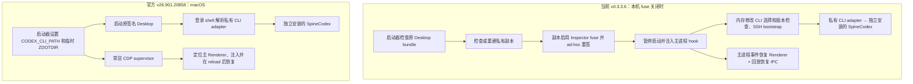

# 官方 v26.901.20858 与当前 v0.3.3.6 实现对比

本文为 v0.3.3.6 基线的历史分析；后续双模式迭代见 [v26.901.51231 发布说明](RELEASE_NOTES_v26.901.51231_ZH.md)。

日期：2026-09-09。范围：macOS 的启动、CLI 边界、Renderer 恢复、兼容性与运维取舍。

## 结论

**长期建议采用官方的外部 CLI adapter + Renderer supervisor 方向，同时移植当前分支有价值的恢复与诊断功能；当前不宜直接覆盖安装。**

官方方案消除了私有 Desktop 副本、fuse 修改、重签和主进程 bundle 匹配这些依赖，升级维护成本预计更低。当前版本保留了更强的主进程控制和故障恢复能力，并已在本机 Desktop `26.901.51231` 上验证启动。官方版本仅保证 `26.901.20858`；不能把架构更简洁等同于已验证兼容本机版本。

上一轮“合并所有分支”的范围是本地分支和 `frui85/spine-codex-app` 的分支；没有合入 `izumedonabe/spine-codex-app` 的这次架构变更。

## 对比基线与证据边界

- 官方标签 `v26.901.20858` 指向提交 `0a6a3a1d5d3c6336478dfb4793e0116e37296bfc`，与本次只读查询得到的 `origin/main` 一致。
- 当前标签 `v0.3.3.6` 对应提交 `a51ee84a6820c7fc223d58befeaf1b7f196cf3bd`。
- 使用图索引定位后检查覆盖；索引记录的 generation 为 `2026-08-25T08:55:45Z`，部分源文件已变化，因此实质结论以当前源码和上述固定提交的 `git show` 内容为准。
- 当前版本已有本机真实启动、clone 再次复用、签名、完整测试和 GitHub Release 构建成功记录。官方的实机验证来自作者发布说明，本次未在本机切换启动官方版本。
- 本次额外用隔离的 zsh 配置复现了官方 PATH 排序边界，不读取或修改个人 shell 配置。

## 两种启动链路

依据：[当前启动器](https://github.com/frui85/spine-codex-app/blob/a51ee84/spine-app.mjs#L119)、[当前 clone 管理](https://github.com/frui85/spine-codex-app/blob/a51ee84/lib/macos-inspector-clone.mjs#L263)、[官方启动器](https://github.com/izumedonabe/spine-codex-app/blob/0a6a3a1/spine-app.mjs#L90)。

## 相同点

1. 都是包装层，独立调用 SpineCodex，不把 Desktop 或 SpineCodex 打入 DMG。
2. 都使用 `CODEX_CLI_PATH=spine-codex` 这个可移植名称；远端 SSH 解析远端自己的命令，不发送本机 adapter 绝对路径。
3. 两边 `lib/app-server-protocol-adapter.mjs` 和 `lib/app-server-output-filter.mjs` 在比较提交中逐字一致。本地协议适配、重复应用列表通知过滤不是官方这次才新增的能力。
4. 两边 adapter 都向实际 CLI 添加 `--disable image_generation`，并处理 app-server 输入输出。
5. 都使用 Renderer 脚本注入和本机回环 CDP；官方“没有主进程 hook”不等于“完全没有注入或调试端口”。
6. 都提供 Apple Silicon、Intel macOS DMG；Windows 发布流水线仍停用。

依据：[当前 adapter](https://github.com/frui85/spine-codex-app/blob/a51ee84/bin/spine-codex.mjs)、[官方 adapter](https://github.com/izumedonabe/spine-codex-app/blob/0a6a3a1/bin/spine-codex.mjs)。

## 差异及优缺点

| 维度 | 官方新架构 | 当前 v0.3.3.6 | 判断 |
|---|---|---|---|
| Desktop 本体 | 直接运行原签名应用 | 原应用不动，但实际运行重新签名的私有副本 | 官方减少一份需要维护的 Desktop，也保留原应用签名和 entitlement 环境 |
| 主进程介入 | macOS 不安装 main hook | 打开副本 Inspector，暂停、校验 PID、注入 hook | 当前控制力强；官方避开 fuse 与 Electron 内部加载机制的变化 |
| 本地 CLI 选择 | 临时 `ZDOTDIR` 和 PATH 引导私有 adapter | hook 将本地 selector 指向绝对路径，SSH 仍保留命令名 | 当前选择更确定；官方减少 bundle 依赖，但依赖 shell 环境正确 |
| 版本检查 | 依赖 SpineCodex 报告的上游兼容 CLI 版本 | 修改内存中的版本判断，兼顾较老的 SpineCodex | 官方边界简单；当前向后兼容更宽但补丁维护更多 |
| Renderer reload | 外部 Node 常驻，轮询 target 并重连；注册新文档脚本 | 主进程监听 `web-contents-created`、`did-finish-load` 后恢复 | 两边都能恢复；官方独立可维护，当前主要由事件驱动 |
| Renderer 文件更新 | supervisor 启动时读取的脚本会留在内存中 | 恢复时重新读取并校验已安装 Renderer 文件 | 官方升级 wrapper 后应重启 supervisor；当前已有旧进程加载新脚本的机制 |
| 历史回放故障 | 本次 macOS 链路没有当前 fork 的恢复 IPC | 支持特定 sampling replay mismatch 和超过 8000 字节 memory 的受限恢复 | 直接替换有功能回退，需要迁移而不是默认认为上游已有 |
| SSH 服务重用 | 使用 Desktop 原生 SSH bootstrap | 增加 socket 探活、服务身份、锁、归属校验和 readiness | 当前对残留官方 app-server 的保护更强，但与内部 SSH bundle 耦合 |
| 启动成本 | 无克隆和重签步骤 | 首次或副本变化时复制、签名；每次复用计算 archive SHA-256 | 官方预期更轻；没有相同环境下的性能对照，不给出速度倍数 |
| 常驻成本 | 每 250 ms 查询本机 target 列表，并维持 CDP 连接 | 启动器完成后退出，恢复逻辑驻留在 Desktop 主进程 | 官方存在额外常驻进程和轮询开销；未测量 CPU、内存或电量 |
| 诊断 | 面向单一 Desktop 基线和 CLI 兼容版本 | JSON 诊断、产品/兼容双版本、协议探测、bundle 结构检查 | 当前更利于处理复杂本机环境 |
| 版本表达 | 发布号直接对应受测 Desktop | `0.3.3.6` 表示基线和 wrapper 修订，另列 Desktop 矩阵 | 官方直观，但不能仅凭版本号数字大小比较两套发布；其同一 Desktop 下多次 wrapper 修订规则需另明确 |

主进程相关依据：[补丁入口](https://github.com/frui85/spine-codex-app/blob/a51ee84/spine-electron-main-hook.cjs#L167)、[回放恢复](https://github.com/frui85/spine-codex-app/blob/a51ee84/spine-electron-main-hook.cjs#L886)、[Renderer 恢复](https://github.com/frui85/spine-codex-app/blob/a51ee84/spine-electron-main-hook.cjs#L1054)、[官方 supervisor](https://github.com/izumedonabe/spine-codex-app/blob/0a6a3a1/lib/renderer-supervisor.mjs#L163)。

## 官方方案需要特别注意的实现细节

### 1. “只保证相同版本”不是“只允许相同版本启动”

源码对低于 `26.901.20858` 的 Desktop 报 error；等于时报告验证匹配；高于时记录 `info: unverified`，仍可继续启动。你的已安装原应用是 `26.901.51231`，更高，因此官方没有给出这个组合的兼容保证。

依据：[官方 Desktop 比较逻辑](https://github.com/izumedonabe/spine-codex-app/blob/0a6a3a1/spine-app.mjs#L407)。

### 2. shell 适配存在具体边界

实现生成 `.zshenv`、`.zprofile`、`.zshrc` 等临时文件并设置 `ZDOTDIR`，针对的是 zsh；bash/fish 不能直接假定具有同等覆盖。

此外，PATH 逻辑仅在 adapter 目录“不存在于 PATH”时前置它；若用户启动脚本把真实 CLI 目录放到前面，而 adapter 目录仍留在后面，adapter 不会被重新前置。

隔离复现：模拟 `.zprofile` 设置 `真实CLI目录:adapter目录:/usr/bin:/bin`，执行原函数生成的临时配置，再运行 `zsh -lc 'command -v spine-codex'`。结果为 `adapterSelected=false`、`realBinarySelected=true`。这种情况下本地进程可能绕过协议适配、输出过滤及临时功能禁用。这是复现的配置边界，不代表所有默认 macOS 环境都会失败。

依据：[官方 createMacShellEnvironment](https://github.com/izumedonabe/spine-codex-app/blob/0a6a3a1/spine-app.mjs#L885)。

### 3. supervisor 是新增的生命周期依赖

官方每 250 ms 轮询主 target，初始化等待 20 s；就绪后 CDP 端点连续约 5 s 不可达时退出。supervisor 退出后，新 target 的自动连接恢复无法继续；已注册脚本对已有 target 的效果另当别论。临时 shell 目录还绑定于启动器退出清理，因此需要验证 supervisor 异常退出和 app-server 后续重启的组合。

源码具备精确主页面过滤、回环 WebSocket 及端口校验，也有幂等注入，这些是明确优点。轮询成本和异常退出后用户可感知的影响仍需实测。

依据：[官方 target 筛选](https://github.com/izumedonabe/spine-codex-app/blob/0a6a3a1/lib/renderer-supervisor.mjs#L7)、[循环与退出条件](https://github.com/izumedonabe/spine-codex-app/blob/0a6a3a1/lib/renderer-supervisor.mjs#L163)。

## 当前方案仍然存在的结构性成本

`v0.3.3.6` 修复的是“副本发生变化后仍误复用”这一缺陷：记录副本身份与 archive SHA-256，不一致就重建。它没有消除副本本身、自动更新后再次变化、重签权限差异或未来 bundle 标记变化的维护成本。

副本签名明确去掉了原开发者专属 entitlement，包括应用组、keychain access groups 和 `com.apple.developer.*`。这可能影响原有共享钥匙串、推送和系统权限体验。这里不能笼统称为“破坏原应用”：原应用确实没有修改，差异发生在实际运行的副本上。

主进程补丁仍依赖错误字符串、压缩函数结构、SSH bootstrap 结构；找不到或出现歧义时会拒绝继续。这种校验能降低静默误补丁风险，但无法提供跨所有未来 Desktop 版本的保证。

依据：[clone 验证与签名](https://github.com/frui85/spine-codex-app/blob/a51ee84/lib/macos-inspector-clone.mjs#L263)、[受限 entitlement](https://github.com/frui85/spine-codex-app/blob/a51ee84/lib/macos-inspector-clone.mjs#L38)、[bundle 契约](https://github.com/frui85/spine-codex-app/blob/a51ee84/lib/desktop-bundle-contract.mjs#L12)。

## 适合我们的后续方向

1. 以官方外部 adapter + supervisor 为候选主架构，先在 `26.901.51231` 验证 initialize、正常对话、Spine Tree、reload、target 替换及 app-server 重启。
2. 先修正 adapter 的 PATH 优先级并核验实际命令路径；明确支持的 shell，检查 supervisor 生命周期和脚本更新后的重启行为。
3. 保留当前双版本识别、JSON 诊断和协议探测；评估将受限回放及 memory 恢复迁到本地 adapter 层，并保留所需 Renderer 别名映射。属于后续开发工作，不能视为已经实现。
4. SSH 的服务身份和旧 socket 清理不在本地 adapter 的控制范围内，需要单独验证或制定远端策略，不能宣称外部 adapter 已等价替代当前 SSH hook。
5. 验证完成并明确功能差异后再切换默认架构。当前已能启动的版本可作为过渡，避免仅因上游发布号变化就覆盖本机版本。

本次仅完成源码对比、隔离复现和文档整理，没有切换运行方案、修改程序逻辑或发布新版本。
